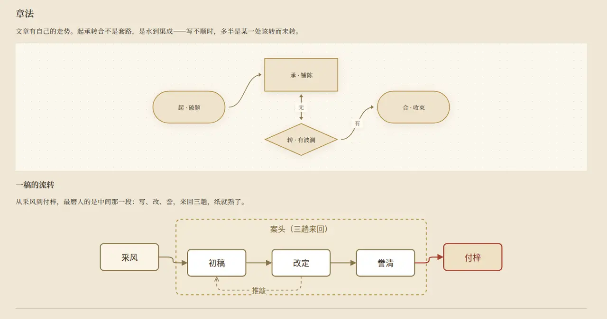
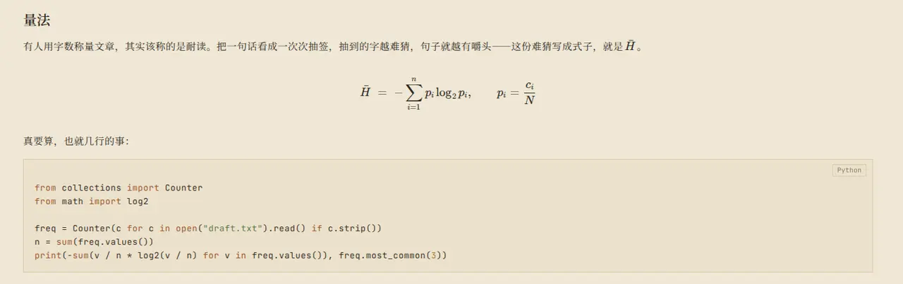
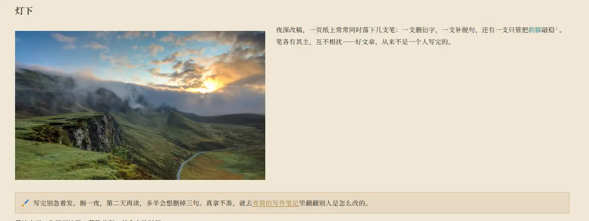
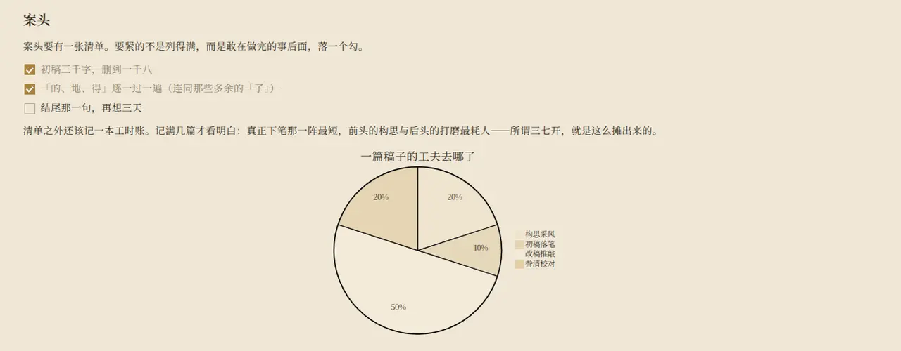

<div align="center">


# 青简 QingAgent

**让 AI 和你默契写作**

更人机友好的文档编写体验，围绕写作场景开箱即用的一系列工具，解决 AI 写稿时，起稿难、review 难、排版难等问题。

[](./LICENSE)
[](https://github.com/from-void/qingagent/releases)
[](https://github.com/from-void/qingagent/actions/workflows/ci.yml)

[官网 qingagent.com](https://qingagent.com) · [下载客户端](https://qingagent.com/#download) · [更新日志](https://qingagent.com/changelog) · [English](./README.en.md)

</div>

---

## 这是什么

青简是一个**装在你自己电脑上的 AI 写作客户端**。

你用大白话告诉它想写什么，它把稿子写进一个真正的编辑器里——不是聊天框里的一段回复，而是一份能排版、能改、能导出的文档。之后每一次修改，AI 都先把改动摆在原文上，你逐条采纳或驳回，**点了才落稿**。

写完直接导出 PDF、Word、Markdown，交付即所见。文档存在你自己的机器上，不经过我们的服务器。

**它解决三件事：**

| 痛点 | 青简的做法 |
|---|---|
| **起稿难** | 一句话交代需求，AI 先问清楚再动笔，四路并发出稿择优，几十秒给你一篇成型初稿 |
| **review 难** | AI 的每处改动都是候选，逐条看、逐条决定；还能请 12 种角色（面试官、甲方、法务、主编……）替你挑刺 |
| **排版难** | 表格、公式、流程图、配图直接排在纸上，写作过程即所见即所得，导出保持同一套观感 |

---

## 一、产品介绍

### 1. 一句话起稿，成稿落在纸上

在对话框说清楚要写什么，青简会先用几个问题收敛需求（不想被问就直说「直接起草」），然后流式把稿子写进右侧的宣纸编辑器。


| | |
|---|---|
|  |  |
| **动笔前先问几句**——主题、侧重、文体确认清楚再生成 | **成稿直接落在编辑器里**——不是聊天记录，是可编辑的文档 |
|  |  |
| **模板起头**——产品需求文档、竞品分析、用户调研等模板一点即填 | **带着资料写**——PDF / Word / Excel 丢进素材区，写稿时随取随用 |

### 2. 编辑器：对标飞书文档 85% 的功能集

稿子落在一个**真正的编辑器**里，不是聊天气泡。表格、公式、流程图、分栏、代码块——写作过程即所见即所得，导出保持同一套观感。

| | |
|---|---|
|  |  |
| **图表两条腿走路**——Mermaid 写流程图 / 时序图 / 饼图；drawio 工程图双击即开离线编辑器改完写回，AI 也能直接读写 | **表格能合并单元格**——跨行跨列表头、单元格底色、粘性表头，行列按住即拖 |
|  |  |
| **公式与代码块**——行内公式与块级公式（KaTeX），代码块自动语法高亮并标注语言 | **图文分栏**——插入分栏后左图右文各自成列；图片、脚注、高亮块（callout）、超链接都在纸上排好 |
|  |  |
| **清单与任务项**——多级列表、任务勾选、五种有序序号（数字 / 字母 / 罗马），勾完自动划线 | **技能随手调用**——联网搜、画配图、算数据，输入框里一点即用 |

工具栏的插入菜单覆盖：图片、文件、行内公式、块级公式、图表、drawio 工程图、表格、分栏、代码块、分隔线。AI 生成的内容走的是同一套结构——**它写进来的表格和图，你可以直接接着改**。

### 3. 先审后应用：AI 改稿，你说了算

让 AI 改稿，它不会直接覆盖你的正文。所有改动先以候选形式摆在原文上，你逐条翻看、采纳或驳回，确认后才落成新版本——不满意的改动永远进不了正文，版本还可回滚。


| | |
|---|---|
|  |  |
| **逐条审查**——上一处 / 下一处翻看，支持局部撤销 | **提交才落稿**——确认后写入新版本 |

### 4. 审查中心：让 AI 当你的编辑部

写完让不同角色替你过一遍稿子。青简出厂带 8 类审查、23 个模板（11 个通用 + 12 个角色视角）：

| | |
|---|---|
|  |  |
| **8 类审查**——敏感词、去 AI 味、来源核查、一致性、隐私、格式、角色、自定义 | **12 种角色视角**——HR 招聘官、面试官、甲方客户、法务合规、主编把关、投资人…… |
|  |  |
| **批注模式**——只给意见不动原文，悬停即见原文、原因与建议 | **忽略过的不再打扰**——你驳回过的建议会被记住 |

两种工作方式：从菜单发起审查**只生成批注、不动正文**；在对话里要求「改一下并审查」，AI 会先改，改动依然作为候选等你确认。

### 5. 写完之后：一稿多形态

| | |
|---|---|
|  |  |
| **衍生稿**——小红书、公众号排版稿、多语种翻译（20 语种，单次最多 5 种） | **封面直接生成**——小红书 5 款封面模板，导出即用 |
|  |  |
| **发布前真机预览**——排出来什么样，先看见 | **五种导出**——PDF / Word / Markdown / HTML / TXT |

### 6. 素材、技能与模型

| | |
|---|---|
|  |  |
| **素材区**——PDF / Word / Excel / PPT / TXT / Markdown / CSV 本地解析入稿 | **联网搜索与网页抓取**——来源可查，不是凭空编造 |
|  |  |
| **13 项内置技能**——浏览器操作、联网搜、读资料、画图表、连飞书、读 GitHub、抓公众号…… | **导入自定义 Skill**——拖一个 `SKILL.md` 或 ZIP 就装好；支持 Anthropic 协议 Skill，方便迁移现有工作流 |
|  |  |
| **自带钥匙**——填自己的 DeepSeek 或 Kimi API Key，快 / 强两档任选 | **用量看板**——token、缓存命中、调用次数与花销，全记在本地 |

### 7. 开源、免费，跑在你自己的电脑上

青简以 MIT 协议开源，除模型 API 外零费用。写完一篇约 3000 字的文章，模型开销大约 **¥0.05 ~ 0.10**（按 DeepSeek V4 Flash 峰谷时段价估算）。数据全部存放在你本地，不经过我们的服务器。

---

## 二、下载与安装

**首选：到 [官网 qingagent.com](https://qingagent.com/#download) 下载客户端**——Windows / macOS 一键安装，也可从 [GitHub Releases](https://github.com/from-void/qingagent/releases) 取包。

| 平台 | 安装包 | 说明 |
|---|---|---|
| Windows | `.exe`（NSIS 安装包）/ `.zip` 便携版 | Windows 10+ · x64 |
| macOS | `.dmg`（拖入应用程序）/ `.zip` | Apple Silicon 与 Intel 双架构，已签名公证，打开即用 |
| Linux | `.AppImage` / `.deb` | 社区支持 |

装好后启动一次，在设置里填入你自己的 DeepSeek 或 Kimi API Key 即可开始写作（打包客户端不读环境变量里的 Key，只认应用内配置）。

---

## 三、桌面客户端为主，也能构建 Web 版

青简**首先是一个桌面客户端产品**：本机数据库、本地文件访问、随包分发的 `qa` 命令行、系统级深链，这些能力都以桌面形态为准。

同时整套代码也可以**构建成 Web 版在本地跑**——适合开发者做走查、验收，以及**在本地调试 Agent 行为**（改提示词、看工具调用、验证技能）。

### 从源码运行

前置：Node ≥ 22、pnpm 9.15.0、一把 [DeepSeek API Key](https://platform.deepseek.com)。

```bash
# 一次性准备
corepack enable && corepack prepare pnpm@9.15.0 --activate

git clone https://github.com/from-void/qingagent.git
cd qingagent
pnpm install

# 配置：填入 Key；Web 形态还需要一把访问 token
cp packages/server/.env.example packages/server/.env
#   DEEPSEEK_API_KEY=<你的 Key>
#   QINGAGENT_AUTH_TOKEN=$(openssl rand -hex 32)

pnpm dev:server   # 后端 http://127.0.0.1:8080
pnpm dev          # 前端 http://localhost:6173（/api 代理到 :8080）
```

> `pnpm dev` 只启动前端，两条命令都要跑。6173 是默认端口，被占用时 Vite 会自动顺延。

打开 `http://localhost:6173`，输入刚才设置的 `QINGAGENT_AUTH_TOKEN` 换取同源 HttpOnly cookie，即可新建会话。token 不会写进 URL。

**Web 形态与桌面的差异**（Web 更保守，很多能力默认关闭）：

| 能力 | 桌面客户端 | Web / 自部署 |
|---|---|---|
| 模型 Key 来源 | 仅应用内配置 | 支持 visitor / 数据库 / 环境变量三层 |
| 未隔离命令、凭据注入、Pyodide | 主进程默认补开 | 需显式开启 |
| 技能 / 模板增删 | 默认开启 | 默认关闭 |
| 连接器（GitHub / 飞书 / 公众号） | 默认可用 | 默认关闭，需声明单用户 |
| Agent 浏览器 | 探测到系统 Chrome/Edge 自动启用 | 默认关闭 |
| PDF 导出 | Electron `printToPDF` | Playwright Chromium |

---

## 四、在 DeepSeek Harness 里使用青简

青简已支持 **DeepSeek Harness 插件体系**——[**dsh-qingagent**](https://github.com/from-void/dsh-qingagent)。

装上插件后，你在 DSH 对话里收敛写作方向，Agent 通过青简引擎起草、局部修改、提交审阅；浏览器右侧同步长出**与青简桌面端同源的宣纸面板**，支持逐条裁决、批注轮播、图编辑与导出。文稿与桌面端**同一本机库**——DSH 里写的，回到青简继续改。

```bash
npx @deepseek-ai/dsh plugin --profile web add dsh-qingagent@latest
```

> 插件依赖本机青简引擎，需要先安装并启动一次青简客户端。详见 [dsh-qingagent 仓库](https://github.com/from-void/dsh-qingagent)。

---

## 五、技术介绍

### 架构总览

```
apps/web              Vite + React SPA（:6173，/api 代理到后端）
apps/desktop          Electron 壳：内嵌 server、深链、qa CLI 分发，数据落 userData
packages/server       Hono HTTP/SSE 服务（:8080），会话网关与路由
packages/core         Mastra agent 大脑：工具、技能、模型、记忆、工作区
packages/db           libSQL 数据访问、迁移与仓储
packages/doc-render   文档渲染与导出（HTML/PDF/DOCX）、浏览器基础设施
packages/pm-schema    TipTap / ProseMirror schema、扩展与 AI-IR 转换
packages/diagram-engine  图表模型与转换引擎
packages/contract-ts  手写前后端契约类型
packages/ui-kit       设计 token 与基础样式的唯一来源
packages/qa-cli       外部 Agent 使用的 qa 命令行
```

**一句话数据流**：用户消息 → Hono SSE → Mastra agent（DeepSeek / Kimi）→ 问卷收敛 → 四路并发起稿择优 → 候选 diff（用户确认 → 乐观并发落版本）→ TipTap/ProseMirror 富文本渲染。生成由服务端自驱动，**断连不停**：关掉页面再回来，稿子还在写。

### 提示词前缀缓存

长会话最大的成本来自反复重传的上下文。青简围绕厂商的 prefix cache 做了一整套前缀稳定化：

- system 运行时指令与环境描述在进程内 memoize，多轮之间字节不变；
- 会话简报只在会话建立时写入，成为不可变前缀；
- 活动文档上下文只追加在**最新一条**用户消息尾部，不重写历史消息；
- 工具定义归一化并排序后参与快照，工具检索带来的新增受控。

`QINGAGENT_PREFIX_CACHE_GUARD` 提供三档守卫：`off` 不检查、`warn` 记录前缀漂移、`strict` 直接抛错（CI 默认 strict）。这套机制配合 DeepSeek 的前缀缓存计费，是「一篇文章几分钱」的直接原因。

### Skill 体系

内置 capability 树共 **13 项顶层技能 + 15 项子技能（28 份 SKILL.md）**：浏览器操作、命令行授权、衍生稿撰写（翻译 / 公众号 / 小红书）、图表可视化（Mermaid / draw.io）、算数据、连飞书、GitHub 读取、画配图（SVG 插画 / 本机 Codex 图片）、看图片、读资料、文档审查（8 个子类）、联网搜、抓公众号。

用户可上传单个 `SKILL.md` 或 ZIP 包安装到 `~/.qingagent/skills`。技能解析器识别 YAML frontmatter（`name` / `description` / `label`），并会扫描 `~/.claude`、`~/.codex`、`~/.agents` 目录——**你在 Claude Code、Codex 生态里已有的技能，青简能直接发现并复用**。

### 观察记忆（Observational Memory）

每个会话挂一个观察记忆 sidecar，用 flash 档模型持续把长对话压成观察记录。上下文超过 50 万 token 时触发压缩投影，用「观察结果 + 最近 12 轮」替代完整历史——几十轮对话之后，早期定下的细节依然不丢。默认开启，会产生额外的观察模型调用与费用。

### 审查中心的实现

8 类审查（`sensitive` / `deai` / `source` / `consistency` / `privacy` / `format` / `role` / `custom`），出厂 23 个模板。敏感词走确定性词库扫描，命中先形成批注、替换只作候选，不做机械替换。忽略决策以经过 PII 屏蔽的稳定 key 落库，可生成文档级审查补充。

### 外部 Agent 接入

桌面包随附 `qa` 命令行（`Resources/qa-cli/cli.mjs`，首次启动在 `~/.qingagent/bin/qa` 写入 shim）。Claude Code、Codex 等外部 Agent 通过 `/api/v1/external/*` 可以：读文档与会话、发送聊天、上传读取附件、提交修改 proposal、订阅事件、管理审查模板与技能。

proposal 操作全集：`fullDraft`、`qingml`、`setTitle`、`strReplace`、`markText`、`insertAfterLine`、`insertAfterBlock`、`appendSection`、`deleteBlock`、`deleteListItem`。**外部 Agent 的改动同样进入审阅流程**，不会静默覆盖正文。

### 单库 attach 模式

桌面启动时在 `~/.qingagent/instance.json` 写下实例信息（`schemaVersion` / `port` / `pid` / `version` / `attachProtocolVersion` / `instanceId` / `libraryId` / 256-bit `token` / `startedAt`）。端口默认 `21823`，被占用则由系统分配随机端口——**读到的实例端口才是权威**。

第二个桌面进程发现同 `libraryId` 的有效实例时进入 attach 模式复用它，否则自起内嵌 server。token / session 失效会自动重新鉴权；原实例失联后按 1–8 秒指数退避，约 30 秒内完成重发现。DSH 插件正是通过这套协议连上青简的。

### 导出管线

ProseMirror 文档先处理图表等富内容生成 HTML，再分流：Web / server 走 Playwright Chromium A4 渲染 PDF，桌面走 Electron `printToPDF`；DOCX、TXT、Markdown、HTML 各有对应转换。

---

## 六、配置参考

桌面客户端单机自用零配置；**Web / 自部署形态必须设置 `QINGAGENT_AUTH_TOKEN`**。下表按需取用。

**基础**

| 变量 | 默认 | 说明 |
|---|---|---|
| `DEEPSEEK_API_KEY` | 未设置 | 模型 Key。优先级：应用内配置 > 数据库 > 环境变量。**打包桌面不读环境变量，只认应用内配置** |
| `PORT` | server `8080` | 后端端口。Web 端口用 `QINGAGENT_WEB_PORT` |
| `QINGAGENT_WEB_PORT` | `6173` | Vite dev/preview 端口，优先于 `PORT`；端口占用会自动顺延 |
| `QINGAGENT_DEEPSEEK_BASE_URL` | 官方端点 | 自定义模型网关 |
| `QINGAGENT_MODEL_FLASH` / `_PRO` | DeepSeek `deepseek-v4-flash` / `deepseek-v4-pro`；Kimi `kimi-for-coding` / `k3` | 快 / 强两档模型 id |
| `QINGAGENT_MODEL_PROTOCOL` | `openai` | 模型协议（`openai` / `anthropic`）。Kimi 固定 OpenAI 兼容 |
| `QINGAGENT_ALLOW_PRIVATE_MODEL_HOST` | server 关；桌面 `1` | 放行主模型访问私网/链路本地；loopback 无需开启 |

**功能开关**

| 变量 | 默认 | 说明 |
|---|---|---|
| `QINGAGENT_AGENT_BROWSER` | server 关；桌面探测到系统 Chrome/Edge 自动补 `1` | Agent 浏览器抓取 |
| `QINGAGENT_OM_SIDECAR` | 开 | 观察记忆。未显式关闭即会产生观察模型调用与费用 |
| `QINGAGENT_OM_COMPRESS` | 开 | 超长上下文压缩投影（阈值 `QINGAGENT_OM_COMPRESS_THRESHOLD_TOKENS`，默认 500000） |
| `QINGAGENT_TOOL_SEARCH` | 关 | 低频工具按需检索（省上下文，略增延迟） |
| `QINGAGENT_PYODIDE_ENABLED` | 未设置时探测资源，可用即启用；桌面补 `1` | Python 沙箱（算数据技能用） |
| `QINGAGENT_PROCESSOR_PROMPT_INJECTION` / `_MODERATION` / `_PII` | 关 | LLM 输入护栏三件套 |
| `QINGAGENT_PREFIX_CACHE_GUARD` | `off`；CI 环境 `strict` | 前缀缓存守卫 off/warn/strict |
| `QINGAGENT_AGENT_MAX_STEPS` / `_IDLE_TIMEOUT_MS` | `200` / `90000` | agent 单轮步数上限 / 空闲超时 |
| `QINGAGENT_USER_VERSION_WINDOW_MS` | `60000` | 用户编辑版本折叠窗口（0 关闭） |
| `QINGAGENT_SKILLS_DIR` / `_USER_SKILLS_DIR` / `QINGAGENT_LOG_DIR` | 内置目录 / `~/.qingagent/skills` / `.logs` | 路径覆盖。桌面各自指向 `resources/skills` 与 `userData` |

**安全与部署**

| 变量 | server 默认 | 桌面默认 | 作用 |
|---|---|---|---|
| `QINGAGENT_AUTH_TOKEN` | 未设置 | 不需用户配置 | Web 形态的 command mutation 必须配置；非回环监听未设置时服务端拒绝启动。桌面由主进程生成临时 global command token（与 `instance.json` 中供 external/attach 使用的 token 是两把不同的钥匙） |
| `QINGAGENT_HOST` | `127.0.0.1` | 固定回环 | 后端监听地址 |
| `QINGAGENT_TRUSTED_ORIGINS` | 空（内置本机开发 Origin） | 同 server | 额外可信完整 Origin（含协议），逗号分隔 |
| `QINGAGENT_PUBLIC_ORIGIN` | 未设置 | 未设置 | 导出内容中 `/api/` 链接的 canonical origin |
| `QINGAGENT_TRUST_PROXY` | 未设置 | 未设置 | 仅 `=1` 采信 `X-Forwarded-Host/Proto` |
| `QINGAGENT_ALLOW_UNAUTHENTICATED_PUBLIC` | 未设置 | 未设置 | 高危逃生开关：`=1` 允许无 token 的非回环监听 |
| `QINGAGENT_PUBLIC_DEPLOYMENT` | 未设置 | 未设置 | 声明公网可达部署，用于 debug/dataAdmin 分层门 |
| `QINGAGENT_BROWSER_PROXY_ACL` | 未设置 | 未设置 | 配置了 HTTP(S)_PROXY 时必须设为 `deny-private`，否则代理浏览器 fail-closed |
| `QINGAGENT_ENABLE_DEBUG` | 未设置 | 未设置 | debug / dataAdmin 路由默认 404 |
| `QINGAGENT_ALLOW_NO_SANDBOX` | 未设置 | 未设置 | 高危逃生阀：`=1` 会给 Chromium 加 `--no-sandbox`。默认强制 sandbox |
| `QINGAGENT_TELEMETRY_DISABLED` | 未设置 | 未设置 | `=1` 关闭官方桌面包的匿名统计 |
| `QINGAGENT_UPLOAD_MAX_BYTES` | `52428800`（50 MB） | 同 server | 单文件上传上限 |
| `DATABASE_URL` | `~/.qingagent/qingagent.db` | `userData/qingagent.db` | libSQL 数据库位置 |

**高危能力（务必读懂再开）**

| 变量 | server | 桌面 | 说明 |
|---|---|---|---|
| `QINGAGENT_ALLOW_UNISOLATED_COMMANDS` | 变量默认未设置，但**全局安全档当前默认「不再询问」，实际会放行**未隔离命令 | 主进程补 `1` | 允许 agent 在本机执行命令；公网开启等同扩大 RCE 面 |
| `QINGAGENT_SANDBOX_INJECT_CREDENTIALS` | 变量默认关（接受 `1/true/yes/on`），但默认安全档同样会装配完整用户环境 | 主进程补 `1` | 会把凭据注入执行环境 |
| `QINGAGENT_ALLOW_SKILL_MUTATION` | 默认关 | **主进程无条件写 `1`，显式 `0` 无法关闭** | 允许安装 / 删除技能 |
| `QINGAGENT_ALLOW_TEMPLATE_MUTATION` | 默认关 | **主进程无条件写 `1`，显式 `0` 无法关闭** | 允许 external API 增删改审查模板 |

---

## 七、安全声明

> **⚠️ 部署安全警告：青简当前按单用户、单租户设计，没有用户间的数据或权限隔离。`QINGAGENT_AUTH_TOKEN` 只是全有全无的共享密钥，不建立用户身份；任何持有密钥、能访问后端 API 的人都可以读取、修改和删除全部会话与文档，并消耗你配置的模型额度。切勿以多租户形态部署到公网。**

- **默认边界是本机回环**：后端默认只监听 `127.0.0.1`，桌面端开箱即是这个形态。要让外部设备访问，必须由部署者显式改配置并承担加固责任。
- **命令通道**：`POST /api/v1/commands` 始终要求确定性凭据与可信 Origin。桌面由主进程代理注入 global command token，renderer 页面拿不到；`instance.json` 中的 token 只服务于 `/api/v1/external/*` 与 attach。
- **`?auth=<token>` 只是本机调试逃生舱**：应用日志会 redact，但完整 URL 仍可能进入浏览器历史与反代日志，公网部署请改用 `Authorization: Bearer`。
- **部署形态**：会话运行状态在单进程内存中，SSE 绑定该进程，不支持多实例横向扩展；文档与版本持久化在本机数据库。
- **Chromium 边界**：抓取、PDF 导出与自主浏览器默认启用 sandbox 与站点隔离。存在高危逃生开关 `QINGAGENT_ALLOW_NO_SANDBOX=1` 会加上 `--no-sandbox`，仅限你完全理解后果时使用。浏览器经代理出站时，代理必须在连接层拒绝私网 / 环回 / 链路本地 / 云元数据目标，并设 `QINGAGENT_BROWSER_PROXY_ACL=deny-private` 作确认；未确认时抓取 fail-closed。
- **拒启规则**：只有在实际监听地址非回环且未设置 `QINGAGENT_AUTH_TOKEN` 时，服务端才拒绝启动；非回环监听须显式设置 `QINGAGENT_ALLOW_UNAUTHENTICATED_PUBLIC=1` 才放行并打印审计告警。

公网反代（仅适用于同一位可信用户从自己设备访问）：nginx/caddy + HTTPS + 强随机 `QINGAGENT_AUTH_TOKEN` + 精确的 `QINGAGENT_TRUSTED_ORIGINS`（须含协议的完整 Origin）。

**数据与备份**：数据库为 `DATABASE_URL` 指向的 libSQL 文件（默认 `~/.qingagent/qingagent.db`，桌面在 `userData` 下）。备份时一并复制 `-wal` / `-shm`，或先停服务。沙箱凭据加密存放在同库 `sandbox_credentials` 表。

漏洞报告见 [SECURITY.md](./SECURITY.md)，请勿在公开 issue 中披露未修复漏洞。

---

## 八、隐私与遥测

- **源码 / 本地构建**：默认构建不含上报端点配置，**不会发送任何数据**。
- **官方桌面发布包**：匿名使用统计（启动、功能点击、脱敏报错，自托管 Umami），**不采集文档正文、聊天输入、附件内容或 API Key**；设置 `QINGAGENT_TELEMETRY_DISABLED=1` 一键关闭。
- 全部事件字段见 [PRIVACY.md](./PRIVACY.md)。

---

## 九、参与贡献

欢迎 issue 与 PR。几条实操约定：

1. **大改动先开 issue 讨论**——架构调整、新依赖、交互改版，先对齐方向再动手，避免白写。
2. **PR 必须通过 `pnpm check`**（typecheck + 测试 + 构建）。CI 红灯的 PR 不会被合并。
3. **提交信息中文英文皆可**，但要写清楚动机：改了什么、为什么改、影响面在哪。
4. **引入新的运行时依赖需说明理由**——本项目对包体积与供应链敏感，能自己写的小工具不引库。
5. **改到安全默认值、鉴权、Chromium 沙箱、外部 API 的 PR**，请在描述里单列一段安全影响分析。
6. **文档改动请同步中英两份 README**（`README.md` / `README.en.md`），保持事实一致。
7. **安全漏洞不要开公开 issue**，发 security@qingagent.com，详见 [SECURITY.md](./SECURITY.md)。

开发规范与目录约定见 [CONTRIBUTING.md](./CONTRIBUTING.md)，行为准则见 [CODE_OF_CONDUCT.md](./CODE_OF_CONDUCT.md)。

---

## 十、用户交流群

扫码加入用户微信群，反馈问题、提需求、看更新：

<!-- TODO: 微信群二维码待补 -->
<!--  -->

也欢迎到 [需求广场](https://qingagent.com/feedback) 提需求投票——呼声高的优先做。

---

## 十一、联系作者

- 使用问题、bug、需求：[GitHub Issues](https://github.com/from-void/qingagent/issues)
- 安全问题：security@qingagent.com

<!-- TODO: 作者联系方式待补 -->

---

## 许可证

[MIT](./LICENSE)。捆绑第三方组件声明见 [THIRD_PARTY_NOTICES.md](./THIRD_PARTY_NOTICES.md)。
