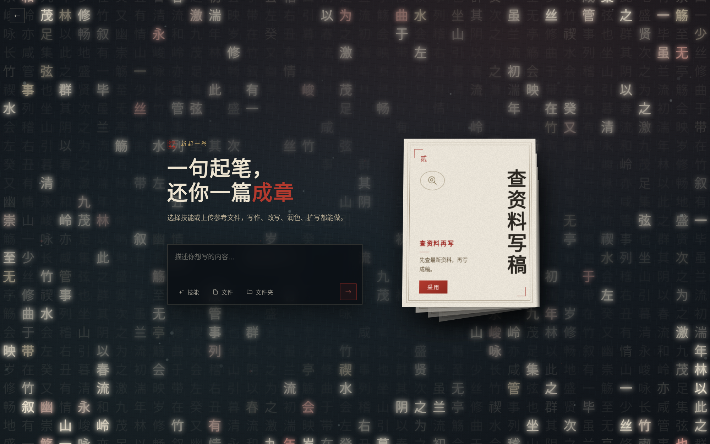
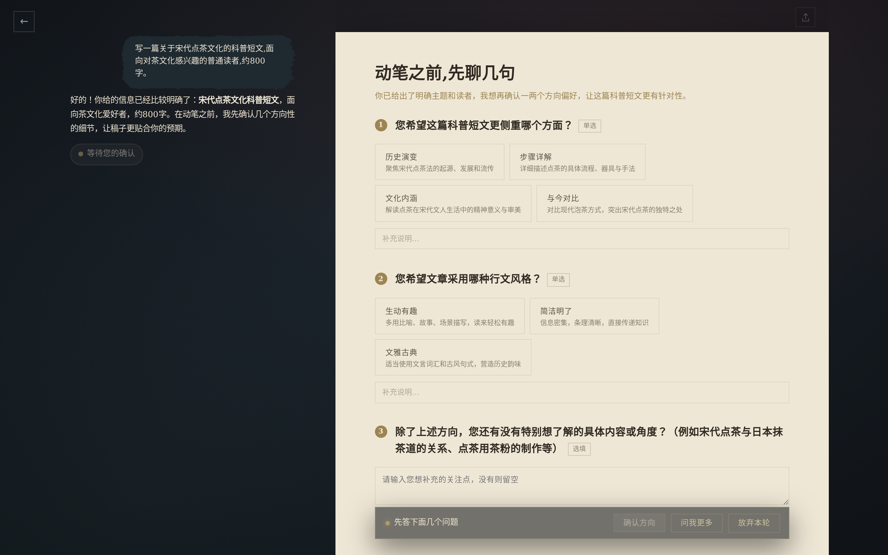

# 青简 qingagent

> 本地优先的 AI 中文写作工作台:对话式起稿、逐条审改、宋体暖纸的排版审美,文档始终在你自己手里。

[](./LICENSE)
[](https://github.com/from-void/qingagent/actions/workflows/ci.yml)
<!-- Release 徽章待首个 release 后回填:[](https://github.com/from-void/qingagent/releases) -->




<!-- 候选主图之一:新建页(新起一卷)。工作台流式成稿/审核 diff/导出效果等过程图,
     可自行起服务(pnpm dev / dev:server)后补拍替换,占位见下。 -->

qingagent is a local-first AI writing workbench for Chinese long-form content: chat-driven drafting, reviewable AI edits with per-change accept/reject, and high-fidelity export. Get the desktop app for the primary experience, or run it from source with a single DeepSeek API key.

## 为什么是青简

**文档是一等公民,不是聊天记录的副产品。** AI 起的稿落进真正的富文本编辑器;此后每一次 AI 修改都以候选 diff 呈现,你逐条采纳或拒绝,版本可回滚。不满意的改动永远进不了正文。

**为中文写作而生的排版。** 宋体、暖纸、直角的界面语言,写作过程即所见即所得;导出 PDF/Word 保持同一套观感,写完即交付。

**本地优先,自带钥匙。** 文档与会话存在本机数据库;桌面客户端直接使用你自己的 DeepSeek API Key,不经过任何中间服务器;源码构建零遥测。

## 功能亮点

- **对话驱动写稿**:开场问卷收敛需求 → 初稿多路并发择优 → 流式成稿
- **审核制改稿**:AI 修改先出 diff 候选,采纳才落盘,支持局部采纳
- **富内容**:多级列表、表格、Mermaid 图表、AI 生成配图(SVG)
- **素材区**:本地文件解析(PDF/Word/图片)、网络搜索与网页抓取入稿
- **技能系统**:飞书文档/多维表格等集成,输入框 chip 一点即用
- **观察记忆**:长会话跨几十轮不忘早期细节(默认开启,可显式关闭)
- **高保真导出**:PDF(Chromium 渲染)/ Word / Markdown / HTML
- **双形态**:桌面客户端(Windows/macOS)为主,开发者也可从源码运行 Web

**开场问卷收敛需求**——动笔前先问几句,把主题/侧重/文体确认清楚再生成:



<!-- 待补过程图:审核 diff 逐条采纳 · 素材区解析 · 导出效果对比(起服务后补拍)。 -->

## 下载桌面客户端（首选）

到 [Releases](https://github.com/from-void/qingagent/releases) 下载 Windows 或 macOS 安装包。macOS 当前提供免签名 zip,首次打开时按系统提示放行。

## 从源码运行（开发者）

源码运行适合开发、走查与验收。若你需要自行托管 Web,也从这里开始。

前置:Node >= 22、pnpm 9、一把 [DeepSeek API Key](https://platform.deepseek.com)。

```bash
# One-time
corepack enable && corepack prepare pnpm@9.15.0 --activate

git clone https://github.com/from-void/qingagent.git
cd qingagent
pnpm install

cp packages/server/.env.example packages/server/.env
# 编辑 packages/server/.env,填入:DEEPSEEK_API_KEY=sk-...

pnpm dev:server   # 后端 http://127.0.0.1:8080
pnpm dev          # 前端 http://localhost:6173(web 代理 /api → :8080)
```

打开 `http://localhost:6173`,新建会话即可开写。

## 配置参考

单机自用零配置即可跑;下表按需取用,安全相关变量见下方《安全声明(Security)》。

**基础**

| 变量 | 默认 | 说明 |
|---|---|---|
| `DEEPSEEK_API_KEY` | 必填 | DeepSeek API 密钥(也可在应用设置里按访客填) |
| `PORT` | server 为 `8080`;Web 为 `6173` | server 进程把它用作后端端口;Vite 进程也把它用作 Web 端口兜底。并行启动时不要给两者共用同一个 `PORT`,Web 端优先用 `QINGAGENT_WEB_PORT`。 |
| `QINGAGENT_WEB_PORT` | `6173` | Vite dev/preview 端口,优先级高于 `PORT` |
| `QINGAGENT_DEEPSEEK_BASE_URL` | 官方端点 | 自定义模型网关 |
| `QINGAGENT_ALLOW_PRIVATE_MODEL_HOST` | Web/自部署关；桌面客户端默认 `1` | 仅 `=1` 放行主模型访问私网/链路本地（含云元数据）；loopback 无需开启。桌面端为支持公司内网/自建模型网关默认开启，显式设 `0` 可关；只影响主模型出站，不放宽网页/文档抓取的 SSRF 防线 |
| `QINGAGENT_MODEL_FLASH` / `QINGAGENT_MODEL_PRO` | deepseek 系 | 快/强两档模型 id |
| `QINGAGENT_MODEL_PROTOCOL` | `openai` | 模型协议(`openai`/`anthropic`) |

**功能开关**

| 变量 | 默认 | 说明 |
|---|---|---|
| `QINGAGENT_AGENT_BROWSER` | 关 | Agent 浏览器抓取;需 `npx playwright install chromium`(缺失时优雅降级) |
| `QINGAGENT_OM_SIDECAR` | 开 | 观察记忆(长会话)。未显式关闭即会产生观察模型调用与费用,不会另行征求授权 |
| `QINGAGENT_OM_COMPRESS` | 开 | 超长上下文压缩投影(阈值 `QINGAGENT_OM_COMPRESS_THRESHOLD_TOKENS`,默认 500k) |
| `QINGAGENT_TOOL_SEARCH` | 关 | 低频工具按需检索(省上下文,略增延迟) |
| `QINGAGENT_PYODIDE_ENABLED` | server 关;桌面开 | Python 沙箱(数据处理技能用)。server 需显式 `=1`;桌面主进程缺省补为 `1`,但瘦包未携带 Pyodide 资源时仍不可用 |
| `QINGAGENT_PROCESSOR_PROMPT_INJECTION` / `_MODERATION` / `_PII` | 关 | LLM 输入护栏三件套 |

**运维进阶**

| 变量 | 作用 |
|---|---|
| `QINGAGENT_BROWSER_*` | CDP_URL / HEADFUL / ALLOW_DOMAINS / STORAGE_STATE / PROFILE_DIR(`agentBrowser.ts`) |
| `QINGAGENT_PREFIX_CACHE_GUARD` | 前缀缓存守卫 off/warn/strict(默认 warn,CI strict) |
| `QINGAGENT_AGENT_MAX_STEPS` / `QINGAGENT_AGENT_IDLE_TIMEOUT_MS` | agent 单轮步数上限 / 空闲超时 |
| `QINGAGENT_USER_VERSION_WINDOW_MS` | 用户编辑版本折叠窗口(默认 60000,0 关闭) |
| `QINGAGENT_SKILLS_DIR` / `QINGAGENT_USER_SKILLS_DIR` / `QINGAGENT_LOG_DIR` | 路径覆盖 |

## 架构一览

```
apps/web        Vite + React SPA(:6173,/api 代理到后端)
packages/server Hono HTTP 服务(:8080,libsql 持久化 + DuckDB 观测)
packages/core   Mastra agent 大脑:工具/技能/浏览器/导出/记忆
apps/desktop    Electron 壳(内嵌 server,数据落 userData)
packages/contract-ts 手写前后端契约类型
packages/ui-kit 设计 token 与基础样式的唯一来源(附少量已消费的原始组件,非组件库)
```

一句话数据流:用户消息 → Hono SSE → Mastra agent(DeepSeek)→ AI-IR 草稿工具(askUser 问卷 → writeDraft / editDraft)→ 候选-diff(用户确认 → 乐观并发落版本)→ TipTap/ProseMirror 富文本渲染。生成由服务端自驱动,断连不停。

## 安全声明(Security)

> **⚠️ 部署安全警告:qingagent 当前仅按单用户、单租户设计,没有用户间的数据或权限隔离。`QINGAGENT_AUTH_TOKEN` 只是全有全无的共享密钥,不会建立用户身份或限制会话归属；任何持有密钥、能访问后端 API 的人都可以读取、修改和删除全部会话及文档,并消耗已配置的模型 key 用量。切勿以多租户形态部署到公网。若需要让互不信任的多个用户使用,请等待规划中的 principal 身份与授权模型。**

公网反代只适用于同一位可信用户从自己的设备访问,不能把当前服务安全地变成多人系统。

默认安全边界是本机回环:后端默认只监听 `127.0.0.1`,只允许本机访问;桌面端开箱即是这个形态。要让外部设备或公网访问,必须由部署者显式改配置并承担对应加固责任。

`?auth=<token>` 仅是本机调试的逃生舱。应用自身日志会对它做 redact,但完整 URL 仍可能进入浏览器历史和反向代理访问日志;公网部署应禁用这种传递方式,改用 `Authorization: Bearer` header。

部署边界:会话运行状态保存在单进程内存中,SSE 连接绑定该进程;系统按单实例、单进程设计,不支持多实例横向扩展。文档与版本历史则持久化在本机数据库中。

Chromium 安全边界:抓取、PDF 导出与自主浏览器始终启用 Chromium sandbox 和站点隔离，启动参数不会加入 `--no-sandbox` 或关闭 `IsolateOrigins/site-per-process`。容器部署必须提供可用的 user namespace 与 seccomp；运行环境不支持 sandbox 时，浏览器能力会直接启动失败，不会静默降级。浏览器经 `HTTP_PROXY` / `HTTPS_PROXY` 出站时，代理必须在连接层拒绝私网、环回、链路本地（含 `169.254.0.0/16`、IPv6 等价范围）与云元数据目标，并设置 `QINGAGENT_BROWSER_PROXY_ACL=deny-private` 作部署确认；浏览器流量不会继承 `NO_PROXY` 绕过该 ACL。未确认 ACL 时，代理抓取与交互浏览器 fail-closed。

服务端只有在实际监听地址非回环，且未设置 `QINGAGENT_AUTH_TOKEN` 时才会拒绝启动；回环监听即使遗留了 `QINGAGENT_PUBLIC_DEPLOYMENT=1` 也不拒启。非回环监听只有显式设置高危逃生开关 `QINGAGENT_ALLOW_UNAUTHENTICATED_PUBLIC=1` 才会放行并打印审计告警；这种形态下,任何人都可以读写你的全部文档、消耗模型 key 余额。如果还显式打开 `QINGAGENT_ALLOW_UNISOLATED_COMMANDS`、`QINGAGENT_SANDBOX_INJECT_CREDENTIALS` 或 `QINGAGENT_ALLOW_SKILL_MUTATION`,风险还会扩大到在你的机器上执行命令。不要这样做。

若你确要将服务暴露到公网,请使用 nginx/caddy 反代 + HTTPS(Let's Encrypt)+ 强随机 `QINGAGENT_AUTH_TOKEN` + 精确的 `QINGAGENT_TRUSTED_ORIGINS`。反向代理透传的 `Host` 不会自动成为可信来源,必须把公网前端的完整 Origin（协议 + 主机 + 端口,默认 HTTPS 端口可省略）显式加入该变量。生成 token 示例:

```bash
openssl rand -hex 32
```

服务端环境变量示例:

```bash
QINGAGENT_HOST=127.0.0.1
QINGAGENT_AUTH_TOKEN=<openssl rand -hex 32 的输出>
QINGAGENT_TRUSTED_ORIGINS=https://你的域名
QINGAGENT_PUBLIC_ORIGIN=https://你的域名
QINGAGENT_PUBLIC_DEPLOYMENT=1
```

最小 nginx server 块示例(反代到本机 `127.0.0.1:8080`,透传 Host/Origin,SSE 关闭缓冲):

```nginx
server {
    listen 80;
    server_name 你的域名;
    return 301 https://$host$request_uri;
}

server {
    listen 443 ssl http2;
    server_name 你的域名;

    ssl_certificate /etc/letsencrypt/live/你的域名/fullchain.pem;
    ssl_certificate_key /etc/letsencrypt/live/你的域名/privkey.pem;

    location / {
        proxy_pass http://127.0.0.1:8080;
        proxy_http_version 1.1;
        proxy_set_header Host $host;
        proxy_set_header Origin $http_origin;
        proxy_set_header X-Forwarded-For $proxy_add_x_forwarded_for;
        proxy_set_header X-Forwarded-Proto $scheme;
        proxy_buffering off;
        proxy_read_timeout 3600s;
    }
}
```

配置速查:

| 变量 | server 形态默认值 | 桌面形态默认值 | 作用 |
|---|---|---|---|
| `QINGAGENT_AUTH_TOKEN` | 未设置 | 未设置 | API token。回环监听未设置时保持本机零配置直通;非回环监听未设置时服务端 fail-closed、拒绝启动。 |
| `QINGAGENT_TRUSTED_ORIGINS` | 空;内置本机 Web 开发端口的精确 loopback Origin | 同 server | 额外可信完整 Origin（须含协议,不能只写 Host）,多个值用逗号分隔。公网反代须设为 `https://你的域名`。 |
| `QINGAGENT_PUBLIC_ORIGIN` | 未设置 | 未设置 | 导出内容中 `/api/` 链接使用的 canonical origin。公网 HTTPS 反代建议显式设置，优先级高于请求与 forwarded 头。 |
| `QINGAGENT_TRUST_PROXY` | 未设置 | 未设置 | 仅 `=1` 时采信 `X-Forwarded-Host/Proto`。只有入口反代会剥离客户端伪造头并重写可信值时才开启。 |
| `QINGAGENT_HOST` | `127.0.0.1` | `127.0.0.1` | 后端监听地址。公网或容器入口需要显式改为合适地址;默认只监听本机。 |
| `QINGAGENT_ALLOW_UNAUTHENTICATED_PUBLIC` | 未设置 | 未设置 | 高危逃生开关。仅 `=1` 允许无 token 的非回环监听,启动时打印审计告警。 |
| `QINGAGENT_PUBLIC_DEPLOYMENT` | 未设置 | 未设置 | 设为 `1` 时显式声明这是公网/外部可达部署，用于 debug/dataAdmin 分层门；启动拒绝仍只由实际非回环绑定决定。 |
| `QINGAGENT_BROWSER_PROXY_ACL` | 未设置 | 未设置 | 浏览器配置了 `HTTP_PROXY` / `HTTPS_PROXY` 时必须设为 `deny-private`，确认代理在实际连接层拒绝私网/环回/链路本地/元数据地址；否则代理浏览器 fail-closed。 |
| `QINGAGENT_ENABLE_DEBUG` | 未设置 | 未设置 | debug 与 dataAdmin 路由默认返回 404。仅 `=1` 开启;对外暴露且无 `QINGAGENT_AUTH_TOKEN` 时会被忽略。 |
| `QINGAGENT_UPLOAD_MAX_BYTES` | `52428800`（50 MB） | 同 server | 单个上传文件解码后的最大字节数；服务端同时限制 base64 JSON 请求体，前端按默认 50 MB 预检。 |
| `DATABASE_URL` | `file:./qingagent.db` | Electron `userData/qingagent.db` | libsql 数据库位置。自托管时建议指向可备份的持久卷或绝对路径。 |
| `QINGAGENT_ALLOW_UNISOLATED_COMMANDS` | 关闭;仅显式 `=1` 开启 | 开启;未设置时主进程补 `1` | 高危能力。允许 agent 在本机执行未隔离命令;公网开启等同扩大 RCE 面。显式 `=0` 可关闭桌面默认。 |
| `QINGAGENT_SANDBOX_INJECT_CREDENTIALS` | 关闭;仅显式 `=1` 开启 | 开启;未设置时主进程补 `1` | 高危能力。会把凭据注入执行环境;公网开启等同扩大 RCE 面。显式 `=0` 可关闭桌面默认。 |
| `QINGAGENT_ALLOW_SKILL_MUTATION` | 关闭;仅显式 `=1` 开启 | 开启;未设置时主进程补 `1` | 高危能力。允许安装/删除技能;公网开启等同扩大 RCE 面。显式 `=0` 可关闭桌面默认。 |
| `QINGAGENT_ALLOW_TEMPLATE_MUTATION` | 关闭;仅显式真值开启 | 开启;未设置时主进程补 `1` | 允许 external API 创建、修改、删除、选择审查模板及写入文档级补充。内置模板始终只读。 |

安全建议（本单仅披露现状,不改代码默认值）:`QINGAGENT_OM_SIDECAR` / `QINGAGENT_OM_COMPRESS` 缺省开启会在没有独立授权步骤时产生额外模型调用与费用,建议后续改为显式 opt-in；桌面形态缺省开启三项高危能力虽服务于本机单用户体验,仍建议按最小权限重新评估,尤其不要沿用到外部可达部署。

数据与备份:默认服务端数据库是 `DATABASE_URL` 指向的 libsql 文件,未设置时为 `file:./qingagent.db`;桌面端数据库位于 Electron `userData` 目录下的 `qingagent.db`。备份时复制该数据库文件;如果同目录存在 `qingagent.db-wal` / `qingagent.db-shm`,也一并复制或先停服务再备份。沙箱凭据存放在同库的 `sandbox_credentials` 表中,值加密落库;备份数据库即同时备份这些凭据密文。

漏洞报告渠道见 [SECURITY.md](SECURITY.md)。请不要在公开 issue 中披露未修复漏洞。

## 隐私与遥测

- 源码构建 / 本地构建:**零遥测**,源码内不含任何上报端点。
- 官方桌面发布包:匿名使用统计(启动/功能点击/脱敏报错,自托管 Umami),**不采集文档正文、聊天输入、附件内容或 API Key**;设置 `QINGAGENT_TELEMETRY_DISABLED=1` 一键关闭。
- 细则与全部事件字段见 [PRIVACY.md](./PRIVACY.md)。

## 贡献 / 安全 / 许可证

- 参与开发:[CONTRIBUTING.md](./CONTRIBUTING.md) · 行为准则:[CODE_OF_CONDUCT.md](./CODE_OF_CONDUCT.md)
- 安全漏洞:请发 security@qingagent.com,勿开公开 issue,详见 [SECURITY.md](./SECURITY.md)
- 许可证:[MIT](./LICENSE);捆绑第三方组件声明见 [THIRD_PARTY_NOTICES.md](./THIRD_PARTY_NOTICES.md)
