# 可渲染范本

以下源码是结构范本，不是要照抄的业务内容。改写 label 时保留稳定 id、分组、style 与布局纪律。

<!-- diagram-viz:template:mermaid:start -->

## Mermaid：三阶段发布流程

```mermaid
%%{init: {'theme':'base','themeVariables':{'background':'#FAF6EC','primaryColor':'#FFFFFF','primaryBorderColor':'#2F2A22','primaryTextColor':'#2F2A22','lineColor':'#B3A791','edgeLabelBackground':'#FFFFFF','textColor':'#2F2A22','fontSize':'14px'}}}%%
flowchart LR
  subgraph planGroup["规划阶段"]
    direction TB
    requirement["确认需求"] --> design["评审方案"]
  end
  subgraph buildGroup["构建阶段"]
    direction TB
    develop["开发实现"] --> test["自动测试"]
  end
  subgraph releaseGroup["发布阶段"]
    direction TB
    approve["发布审批"] --> deploy["灰度发布"]
  end
  design -->|进入开发| develop
  test -->|测试通过| approve
  classDef planNode fill:#FFFFFF,stroke:#2F2A22,stroke-width:2px,color:#2F2A22,rx:8px,ry:8px
  classDef buildNode fill:#FFFFFF,stroke:#A8823F,stroke-width:2px,color:#2F2A22,rx:8px,ry:8px
  classDef releaseNode fill:#FFFFFF,stroke:#8A7F6E,stroke-width:2px,color:#2F2A22,rx:8px,ry:8px
  class requirement,design planNode
  class develop,test buildNode
  class approve,deploy releaseNode
  style planGroup fill:#FAF6EC,stroke:#2F2A22,stroke-width:2px,stroke-dasharray:6 4,color:#2F2A22
  style buildGroup fill:#EFE7D6,stroke:#A8823F,stroke-width:2px,stroke-dasharray:6 4,color:#2F2A22
  style releaseGroup fill:#FAF6EC,stroke:#8A7F6E,stroke-width:2px,stroke-dasharray:6 4,color:#2F2A22
```

图标题应放在图前的 heading 块，例如 `<h2>版本发布流程</h2>`。图表块 source：



写入 QingML 时只包裹 source，并把其中裸 `&` / `<` 转义：

```text
<mermaid>…上面的 Mermaid source…</mermaid>
```

<!-- diagram-viz:template:mermaid:end -->

<!-- diagram-viz:template:drawio:start -->

## draw.io：三层服务架构

下面是未压缩明文 source。坐标和尺寸均为 20 的倍数；容器浅填充、内部节点白底；层距为 120；边为正交灰线，标签白底并向上偏移 12。每个节点必须归属语义正确的层容器，存储组件必须落在数据层容器内，层名与成员语义一一对应：

```xml
<mxGraphModel dx="0" dy="0" grid="1" gridSize="20" page="1" pageScale="1" pageWidth="1160" pageHeight="820">
  <root>
    <mxCell id="0"/>
    <mxCell id="1" parent="0"/>
    <mxCell id="client-zone" value="接入层" style="rounded=1;arcSize=8;whiteSpace=wrap;html=0;fillColor=#FAF6EC;strokeColor=#2F2A22;strokeWidth=2;dashed=1;fontColor=#2F2A22;fontSize=24;fontStyle=1;verticalAlign=top;spacingTop=12;" vertex="1" parent="1">
      <mxGeometry x="40" y="40" width="920" height="140" as="geometry"/>
    </mxCell>
    <mxCell id="service-zone" value="服务层" style="rounded=1;arcSize=8;whiteSpace=wrap;html=0;fillColor=#EFE7D6;strokeColor=#A8823F;strokeWidth=2;dashed=1;fontColor=#2F2A22;fontSize=24;fontStyle=1;verticalAlign=top;spacingTop=12;" vertex="1" parent="1">
      <mxGeometry x="40" y="300" width="920" height="140" as="geometry"/>
    </mxCell>
    <mxCell id="data-zone" value="数据层" style="rounded=1;arcSize=8;whiteSpace=wrap;html=0;fillColor=#FAF6EC;strokeColor=#8A7F6E;strokeWidth=2;dashed=1;fontColor=#2F2A22;fontSize=24;fontStyle=1;verticalAlign=top;spacingTop=12;" vertex="1" parent="1">
      <mxGeometry x="40" y="560" width="920" height="140" as="geometry"/>
    </mxCell>
    <mxCell id="web-client" value="Web 客户端" style="rounded=1;arcSize=8;whiteSpace=wrap;html=0;fillColor=#FFFFFF;strokeColor=#2F2A22;strokeWidth=2;fontColor=#2F2A22;fontSize=14;spacing=8;" vertex="1" parent="1">
      <mxGeometry x="240" y="100" width="160" height="60" as="geometry"/>
    </mxCell>
    <mxCell id="mobile-client" value="移动端" style="rounded=1;arcSize=8;whiteSpace=wrap;html=0;fillColor=#FFFFFF;strokeColor=#2F2A22;strokeWidth=2;fontColor=#2F2A22;fontSize=14;spacing=8;" vertex="1" parent="1">
      <mxGeometry x="600" y="100" width="160" height="60" as="geometry"/>
    </mxCell>
    <mxCell id="api-gateway" value="API 网关" style="rounded=1;arcSize=8;whiteSpace=wrap;html=0;fillColor=#FFFFFF;strokeColor=#A8823F;strokeWidth=3;fontColor=#2F2A22;fontSize=14;spacing=8;" vertex="1" parent="1">
      <mxGeometry x="240" y="360" width="160" height="60" as="geometry"/>
    </mxCell>
    <mxCell id="order-service" value="订单服务" style="rounded=1;arcSize=8;whiteSpace=wrap;html=0;fillColor=#FFFFFF;strokeColor=#A8823F;strokeWidth=2;fontColor=#2F2A22;fontSize=14;spacing=8;" vertex="1" parent="1">
      <mxGeometry x="600" y="360" width="160" height="60" as="geometry"/>
    </mxCell>
    <mxCell id="primary-db" value="主数据库" style="rounded=1;arcSize=8;whiteSpace=wrap;html=0;fillColor=#FFFFFF;strokeColor=#8A7F6E;strokeWidth=2;fontColor=#2F2A22;fontSize=14;spacing=8;" vertex="1" parent="1">
      <mxGeometry x="240" y="620" width="160" height="60" as="geometry"/>
    </mxCell>
    <mxCell id="cache" value="缓存" style="rounded=1;arcSize=8;whiteSpace=wrap;html=0;fillColor=#FFFFFF;strokeColor=#8A7F6E;strokeWidth=2;fontColor=#2F2A22;fontSize=14;spacing=8;" vertex="1" parent="1">
      <mxGeometry x="600" y="620" width="160" height="60" as="geometry"/>
    </mxCell>
    <mxCell id="edge-web-gateway" value="HTTPS" style="edgeStyle=orthogonalEdgeStyle;rounded=1;endArrow=block;strokeColor=#B3A791;strokeWidth=2;labelBackgroundColor=#FFFFFF;fontColor=#8A7F6E;fontSize=13;exitX=0.5;exitY=1;entryX=0.5;entryY=0;" edge="1" parent="1" source="web-client" target="api-gateway">
      <mxGeometry relative="1" as="geometry"><mxPoint x="0" y="-12" as="offset"/></mxGeometry>
    </mxCell>
    <mxCell id="edge-mobile-gateway" value="HTTPS" style="edgeStyle=orthogonalEdgeStyle;rounded=1;endArrow=block;strokeColor=#B3A791;strokeWidth=2;labelBackgroundColor=#FFFFFF;fontColor=#8A7F6E;fontSize=13;exitX=0.5;exitY=1;entryX=0.5;entryY=0;" edge="1" parent="1" source="mobile-client" target="api-gateway">
      <mxGeometry relative="1" as="geometry"><mxPoint x="0" y="-12" as="offset"/></mxGeometry>
    </mxCell>
    <mxCell id="edge-gateway-service" value="路由" style="edgeStyle=orthogonalEdgeStyle;rounded=1;endArrow=block;strokeColor=#B3A791;strokeWidth=2;labelBackgroundColor=#FFFFFF;fontColor=#8A7F6E;fontSize=13;exitX=1;exitY=0.5;entryX=0;entryY=0.5;" edge="1" parent="1" source="api-gateway" target="order-service">
      <mxGeometry relative="1" as="geometry"><mxPoint x="0" y="-12" as="offset"/></mxGeometry>
    </mxCell>
    <mxCell id="edge-service-db" value="持久化" style="edgeStyle=orthogonalEdgeStyle;rounded=1;endArrow=block;strokeColor=#B3A791;strokeWidth=2;labelBackgroundColor=#FFFFFF;fontColor=#8A7F6E;fontSize=13;exitX=0.5;exitY=1;entryX=0.5;entryY=0;" edge="1" parent="1" source="order-service" target="primary-db">
      <mxGeometry relative="1" as="geometry"><mxPoint x="0" y="-12" as="offset"/></mxGeometry>
    </mxCell>
    <mxCell id="edge-service-cache" value="读写" style="edgeStyle=orthogonalEdgeStyle;rounded=1;endArrow=block;strokeColor=#B3A791;strokeWidth=2;labelBackgroundColor=#FFFFFF;fontColor=#8A7F6E;fontSize=13;exitX=0.5;exitY=1;entryX=0.5;entryY=0;" edge="1" parent="1" source="order-service" target="cache">
      <mxGeometry relative="1" as="geometry"><mxPoint x="0" y="-12" as="offset"/></mxGeometry>
    </mxCell>
  </root>
</mxGraphModel>
```

写入 QingML 时把 XML 的 `<` / `&` 转义后包进 `<drawio>`：

```text
<drawio>&lt;mxGraphModel …&gt;…&lt;/mxGraphModel&gt;</drawio>
```

<!-- diagram-viz:template:drawio:end -->
